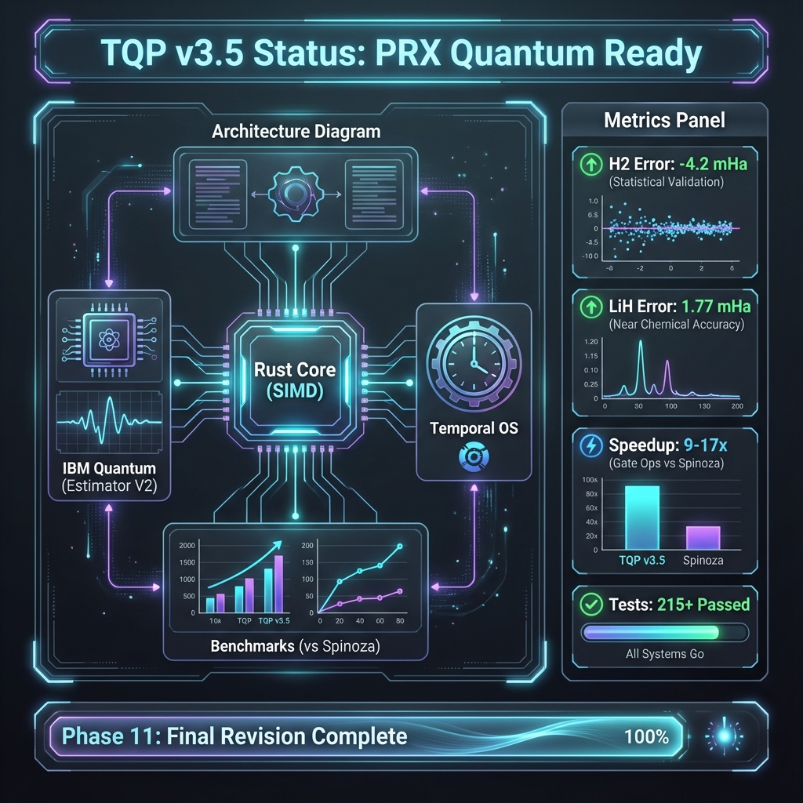

# TQP - Time-Quantized Processing

[](https://github.com/sadpig70/TQP/actions)
[](LICENSE)



A high-performance quantum computing simulation framework with IBM Quantum hardware integration.

## Features

- **Quantum State Simulation**: Fast state-vector simulation with SIMD optimization
- **VQE/QAOA Support**: Variational algorithms with multiple optimizers (COBYLA, SPSA, Adam)
- **IBM Quantum Integration**: Direct hardware execution via Estimator V2 API
- **Error Mitigation**: Zero Noise Extrapolation (ZNE), Readout Error Mitigation
- **Molecular Simulation**: H₂, LiH, BeH₂ Hamiltonian with hardware validation

## Hardware Validation Results

| Molecule | Qubits | Error (mHa) | Backend |
|----------|--------|-------------|---------|
| H₂ | 2 | -4.2 | ibm_torino |
| LiH | 4 | 1.77 | ibm_fez |
| BeH₂ | 14 | - | Pending |

## Installation

Add to your `Cargo.toml`:

```toml
[dependencies]
tqp-core = { git = "https://github.com/sadpig70/TQP" }
tqp-ibm = { git = "https://github.com/sadpig70/TQP" }
```

## Quick Start

```rust
use tqp_core::state::TQPState;
use tqp_core::ops;

fn main() {
    // Create 2-qubit state
    let mut state = TQPState::new(2, 1, 1);
    
    // Apply Hadamard gate
    ops::apply_h(&mut state, 0);
    
    // Measure
    let result = ops::measure(&mut state);
    println!("Measurement: {}", result);
}
```

## Project Structure

```
tqp/
├── tqp-core/        # Quantum simulator core (11K LoC)
├── tqp-ibm/         # IBM Quantum integration (9.5K LoC)
├── tqp-py/          # Python bindings (PyO3)
├── tqp-algorithms/  # Extended algorithms
└── docs/            # Documentation
```

## Documentation

- [Technical Specification v3.5](docs/TQP_Integrated_Specification_3.5.md)
- [PRX Paper](docs/prx/README.md)

## License

MIT License - See [LICENSE](LICENSE)

## Author

Jung Wook Yang (sadpig70)
